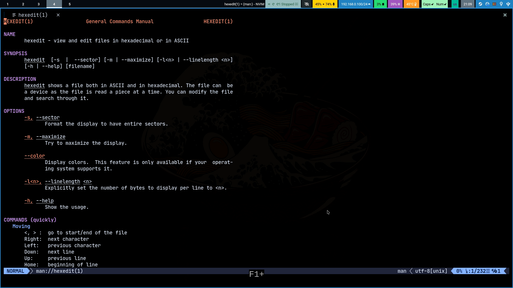
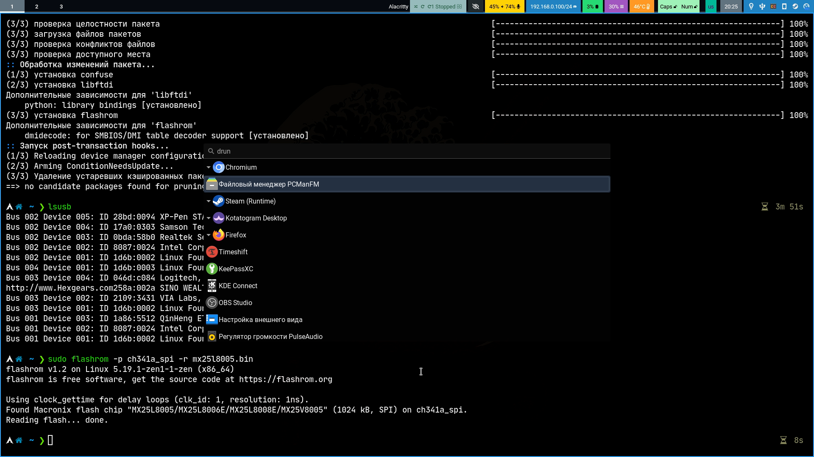
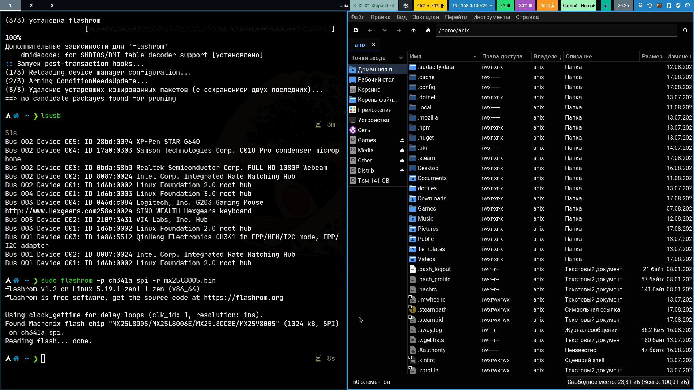

# Мой Dotfiles с композитором Sway

<table><tr>Sway Desktop</tr><tr><td>
</td></tr></table>

<table><tr></tr><tr><td>
</td><td>
</td><td>
</td><tr></table>

## TODO: Проблема с запуском QT приложений с sudo под Wayland Sway

Есть [решение](https://wiki.archlinux.org/title/Running_GUI_applications_as_root#Wayland) но не работает, видимо что-то извне мешает запуску QT программ

[Похожие проблемы](https://forum.garudalinux.org/t/qt-apps-does-not-work-after-fresh-install/18708/23?page=2)
